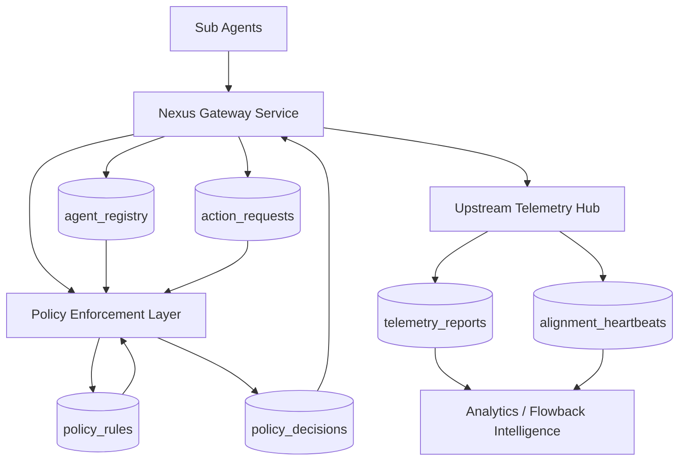

# PRGX-AG Nexus (MCP Governance Gateway)

PRGX-AG is a lightweight governance gateway for Model Context Protocol (MCP)-style agent coordination. This repository focuses on **system structure and data contracts** so sub-agents can be controlled, validated, and observed safely.

## Objectives

- Control high-risk agent actions through policy checks.
- Keep identity + capability negotiation explicit.
- Collect telemetry and alignment heartbeat for flowback intelligence.
- Preserve stability with predictable schemas and validation-ready documentation.

## System Architecture (Database-Centric View)

## Core Services and Data Structures

### 1) Nexus Gateway Service

Main orchestration entrypoint that receives requests from sub-agents.

**Key endpoints**
- `POST /api/v1/initialize`
- `POST /api/v1/action_request`

**Primary data entities**
- `agent_registry`
  - `agent_id` (PK)
  - `agent_name`
  - `public_key`
  - `supported_capabilities` (JSON)
  - `status`
  - `last_seen_at`
- `action_requests`
  - `request_id` (PK)
  - `agent_id` (FK -> `agent_registry.agent_id`)
  - `intent_type`
  - `intent_payload` (JSON)
  - `risk_level`
  - `created_at`

### 2) Policy Enforcement Layer

Synchronous guardrail engine that evaluates safety and governance compliance.

**Core modules**
- `PatimokkhaChecker.is_safe(intent)`
- `IntentTranslator.to_universal(aethebud)`
- `GuardrailUpdater.fetch_latest_policy()`

**Primary data entities**
- `policy_rules`
  - `rule_id` (PK)
  - `rule_version`
  - `rule_name`
  - `rule_definition` (JSON)
  - `is_active`
  - `updated_at`
- `policy_decisions`
  - `decision_id` (PK)
  - `request_id` (FK -> `action_requests.request_id`)
  - `rule_id` (FK -> `policy_rules.rule_id`)
  - `decision` (`allow` / `deny` / `degrade`)
  - `reason`
  - `evaluated_at`

### 3) Upstream Telemetry Hub

Flowback channel for federated learning insights and alignment proof.

**Key endpoints**
- `POST /api/v1/telemetry/report`
- `POST /api/v1/alignment/heartbeat`

**Primary data entities**
- `telemetry_reports`
  - `report_id` (PK)
  - `agent_id` (FK -> `agent_registry.agent_id`)
  - `encrypted_payload`
  - `privacy_level`
  - `created_at`
- `alignment_heartbeats`
  - `heartbeat_id` (PK)
  - `agent_id` (FK -> `agent_registry.agent_id`)
  - `attestation_type`
  - `attestation_payload`
  - `is_valid`
  - `created_at`

## API + Schema Contract Guidance

Recommended Pydantic models:
- `AgentIdentity`
- `AgentCapabilities`
- `ActionIntent`
- `PolicyEvaluationResult`
- `TelemetryEnvelope`
- `AlignmentHeartbeat`

Contract principles:
- Reject unknown critical fields for privileged endpoints.
- Version all policy and attestation payloads.
- Keep decision logs immutable for auditability.

## AI Agent Extension Proposals

The following are proposed function groups that AI agents can implement next:

1. **Adaptive Risk Scoring Function**
   - Dynamically score requests using historical policy decisions.
2. **Policy Drift Detector**
   - Compare active runtime behavior against latest policy ruleset.
3. **Heartbeat Verifier with ZKP Adapter**
   - Standardize verifiers for cryptographic attestation plugins.
4. **Telemetry Anomaly Classifier**
   - Detect suspicious behavior patterns and auto-tag incidents.
5. **Graceful Degradation Orchestrator**
   - Auto-restrict risky capabilities during policy sync failures.
6. **Schema Compatibility Checker**
   - Enforce backward-compatible changes to API contracts.

## English Notes

- Keep this document aligned with live data structures and endpoint contracts.
- Remove stale implementation claims immediately when architecture changes.

## หมายเหตุภาษาไทย

- ควรอัปเดตเอกสารนี้ทุกครั้งที่มีการเปลี่ยนแปลงโครงสร้างข้อมูลหรือสัญญา API
- หากมีการปรับสถาปัตยกรรม ต้องลบข้อความที่ไม่สอดคล้องกับโค้ดจริงทันที
