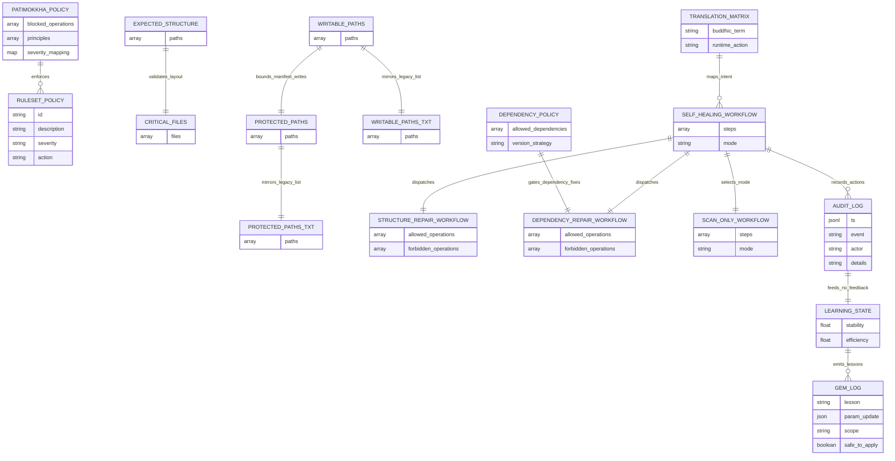

# PRGX-AG Governance Runtime

PRGX-AG is a **Python backend repository with embedded governance specifications**. It combines executable orchestration code under `src/prgx_ag/` with repository-resident policy, manifests, audit state, and workflow definitions under `.prgx-ag/` so the system can observe, interpret, and apply bounded repair actions under explicit safety rules.

## Repository Positioning
- **What this repo is:** an implementation-focused backend/runtime project plus the governance documents it executes against.
- **What this repo is not:** a static documentation-only site, and not a claim of proven large-scale production adoption.
- **Current maturity:** architecture-complete for local development and validation, but still early in public/community traction.

## Standard Term Mapping
The project intentionally uses domain language, but each term maps to a conventional software concept.

| Project term | Standard software meaning |
| --- | --- |
| **Patimokkha** | policy guardrail / safety rule engine |
| **Porisjem Protocol** | governance workflow model |
| **AetherBus** | async event bus / internal pub-sub layer |
| **GemOfWisdom** | bounded learning record / derived improvement artifact |
| **Inspira** | product intent / design principles |
| **Firma** | executable implementation / runtime behavior |
| **PRGX1 Sentry** | scanner / observer agent |
| **PRGX2 Mechanic** | repair executor / fix application agent |
| **PRGX3 Diplomat** | translator / narrative and intent-building agent |
| **Nexus** | orchestrator / coordination service |

## Inspira vs Firma
- **Inspira (เจตจำนง):** constitutional intent, mission, and ethical direction.
- **Firma (โครงสร้าง):** executable implementation that realizes Inspira safely.

The codebase keeps intention, observation, interpretation, execution, ethics, and learning in separate modules to preserve governance boundaries.

## Repository Layout
- `src/prgx_ag/`: Python runtime, orchestrator, agents, schemas, policy evaluators, and services.
- `.prgx-ag/`: governance data such as policies, manifests, workflows, audit state, and learning state.
- `tests/`: regression and integration coverage for the runtime and repository metadata.
- `.github/workflows/`: repository validation and governed automation.
- `package.json` and `index.html`: lightweight repository metadata/proofing assets kept at the root for HTML/metadata checks; they are **supporting repo artifacts**, not the primary application stack.
- `OFFICIAL_SYSTEM_INTEGRATION_REPORT_TH.md`: Thai-language formal system-of-systems integration report covering internal/external operating model links across related repositories.

## System Architecture Diagram (Database-State Aligned)

The runtime is organized around the `.prgx-ag` data stores. Nexus loads policy/manifests/allowlists, routes workflow execution, and persists audit plus learning state into repository-backed operational records.



### `.prgx-ag` Data Layout
- **Policies:** `.prgx-ag/policy/patimokkha.yaml`, `.prgx-ag/policy/ruleset.yaml`
- **Translation layer:** `.prgx-ag/translation/aethebud_matrix.yaml`
- **Manifests:** `.prgx-ag/manifests/expected_structure.yaml`, `critical_files.yaml`, `writable_paths.yaml`, `protected_paths.yaml`
- **State:** `.prgx-ag/state/learning_state.json`, `.prgx-ag/state/gem_log.json`
- **Audit trail:** `.prgx-ag/audit/audit_log.jsonl`
- **Execution flows:** `.prgx-ag/workflows/*.yaml`
- **Dependency allowlist:** `.prgx-ag/allowlists/dependency_policy.yaml`

## PRGX Triad
- **PRGX1 Sentry (The Eye):** read-only entropy scanner for dependency, structure, and integrity drift.
- **PRGX3 Diplomat (Brain/Mouth):** translates findings into healing intent and reviewer-facing narrative.
- **PRGX2 Mechanic (The Hand):** the only component allowed to apply explicit fixes.

## AetherBus Topics
- `porisjem.issue_reported`
- `porisjem.intent_translated`
- `porisjem.execute_fix`
- `porisjem.fix_completed`
- `porisjem.audit_violation`
- `porisjem.rsi_feedback`

## Patimokkha Code
The policy layer blocks destructive intent patterns such as `delete_core`, `shutdown_nexus`, exploit behavior, destructive recursion, hidden destructive updates, and unsafe self-modification.

## Healing Cycle
1. PRGX1 detects anomalies.
2. PRGX3 translates findings into healing intent.
3. PRGX2 validates the intent with Patimokkha and executes bounded repairs.
4. PRGX3 publishes a commit-style narrative for human review.
5. RSI derives a bounded GemOfWisdom and applies only safe learning-state updates.

## Local Setup
```bash
python -m venv .venv
source .venv/bin/activate
pip install -e .[dev]
```

## CLI Usage
```bash
python -m prgx_ag.main --once
python -m prgx_ag.main --continuous --interval 10
python -m prgx_ag.main --scan-only
```

## Testing
```bash
pytest
pytest -q tests/test_pipeline_integration.py tests/test_nexus_cycle.py
python -m compileall src
```

### Required release checks
- `python -m compileall src`
- `pytest -q --maxfail=1`
- `pytest -q tests/test_pipeline_integration.py tests/test_nexus_cycle.py --maxfail=1`

## GitHub Environments for Workflow-Driven Deployments
The repository now reserves three GitHub Environments for workflow-controlled deployment and promotion gates:

- `development`: default environment for feature branches and low-risk workflow dispatch runs.
- `staging`: default environment for `develop`, nightly automation, and governed healing review flows.
- `production`: default environment for `main`/`master` runs and any manually dispatched production promotion.

### Recommended environment protection rules
- Require manual reviewers before `production` jobs continue.
- Store environment-specific secrets only in the matching environment rather than as broad repository secrets.
- Keep branch-to-environment mapping aligned with `.github/workflows/main.yml`, `prgx-nightly.yml`, and `prgx-heal-pr.yml`.

### Suggested environment secrets
- `PRGX_RUNTIME_PROFILE`: optional runtime profile override for the target environment.
- `PRGX_DEPLOY_TARGET`: external deployment target identifier or cluster name if promotion hooks are added later.
- `GITHUB_TOKEN`: continue using the GitHub-provided token unless a narrower environment-scoped token is required.

## Safety Boundaries
- PRGX1 is strictly read-only and does not write files.
- PRGX2 is the sole write authority and is constrained by allowlist/protected-path controls.
- Patimokkha validation occurs before repair execution.

## English Summary
- PRGX-AG is a hybrid repository: executable Python backend plus governance assets in `.prgx-ag`.
- Runtime entrypoint: `src/prgx_ag/main.py`.
- Core orchestration: `src/prgx_ag/orchestrator/nexus.py`.
- Domain-specific terminology is documented above with standard software equivalents to lower onboarding cost.
- Root `package.json` and `index.html` exist as repository metadata/proofing artifacts rather than evidence of a JavaScript frontend.
- Public adoption should be described conservatively as early-stage until meaningful community usage exists.

## สรุประบบภาษาไทย
- PRGX-AG เป็นรีโปแบบผสม: มีทั้ง Python backend ที่รันได้จริง และ governance assets ใน `.prgx-ag`.
- จุดเริ่มรันไทม์หลักอยู่ที่ `src/prgx_ag/main.py`.
- ตัวประสานงานหลักของระบบอยู่ที่ `src/prgx_ag/orchestrator/nexus.py`.
- มีการอธิบายศัพท์เฉพาะควบคู่กับคำมาตรฐานของซอฟต์แวร์เพื่อลด learning curve.
- ไฟล์ `package.json` และ `index.html` ที่ root เป็น metadata/proofing artifacts ของรีโป ไม่ได้หมายความว่าโปรเจ็กต์นี้เป็น JavaScript frontend.
- สถานะการยอมรับจากชุมชนควรถูกอธิบายอย่างระมัดระวังว่าเป็นโครงการระยะเริ่มต้น จนกว่าจะมีการใช้งานสาธารณะที่ชัดเจน.

## Implemented Governance Controls (2026-03-28)
- Typed runtime profiles are active: `development`, `staging`, and `production`.
- Each profile applies different auto-repair thresholds and audit verbosity.
- Runtime now writes signed governance evidence bundles that include:
  - audit-log slices by configurable time window,
  - fix-plan metadata,
  - medical research findings artifact references.

## Remaining Backlog (EN)
1. **Policy simulation sandbox**: add `--simulate-policy` mode for non-writing policy/ruleset rehearsals.
2. **Workflow drift dashboard export**: emit `json/csv` trend bundles for nightly and PR healing jobs.
3. **Controlled auto-rollback hook**: add opt-in rollback execution after failed post-fix verification.

## งานคงค้าง (TH)
1. **โหมดจำลองนโยบาย**: เพิ่ม `--simulate-policy` เพื่อทดสอบกฎโดยไม่เขียนไฟล์จริง
2. **รายงานแนวโน้ม workflow drift**: ส่งออก `json/csv` สำหรับติดตามแนวโน้มจาก nightly และ PR healing
3. **กลไก auto-rollback แบบควบคุมได้**: เพิ่ม rollback แบบ opt-in เมื่อ post-fix verification ล้มเหลว
