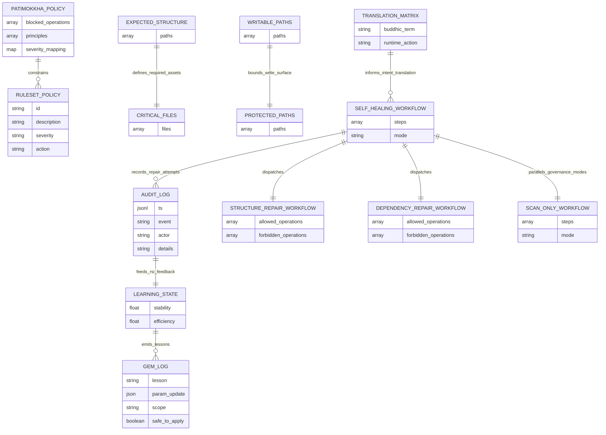

# The Porisjem Protocol (ผู้พิทักษ์แห่งความเงียบ)

PRGX-AG is the backend core of **AETHERIUM GENESIS (AGIOpg)**, designed as an **Eternal Immunity** system: self-observing, self-healing, recursively self-improving, and bounded by Buddhist Ethics as Code.

## Inspira vs Firma
- **Inspira (เจตจำนง):** constitutional intent and mission.
- **Firma (โครงสร้าง):** executable implementation that realizes Inspira safely.

The codebase separates intention, observation, interpretation, execution, ethics, and learning into dedicated modules.

## System Architecture Diagram (Database-State Aligned)

The runtime is organized around the `.prgx-ag` data stores, where the Nexus reads policy/manifests, executes bounded workflows, and records audit plus learning state as durable repository data.



### `.prgx-ag` Data Layout
- **Policies:** `.prgx-ag/policy/patimokkha.yaml`, `.prgx-ag/policy/ruleset.yaml`
- **Translation layer:** `.prgx-ag/translation/aethebud_matrix.yaml`
- **Manifests:** `.prgx-ag/manifests/expected_structure.yaml`, `critical_files.yaml`, `writable_paths.yaml`, `protected_paths.yaml`
- **State:** `.prgx-ag/state/learning_state.json`, `.prgx-ag/state/gem_log.json`
- **Audit trail:** `.prgx-ag/audit/audit_log.jsonl`
- **Execution flows:** `.prgx-ag/workflows/*.yaml`

## PRGX Triad
- **PRGX1 Sentry (The Eye):** read-only entropy scanner (dependencies, structure, integrity drift).
- **PRGX3 Diplomat (Brain/Mouth):** translates findings into healing intent and human narrative.
- **PRGX2 Mechanic (The Hand):** only component allowed to apply explicit fixes.

## AetherBus Topics
- `porisjem.issue_reported`
- `porisjem.intent_translated`
- `porisjem.execute_fix`
- `porisjem.fix_completed`
- `porisjem.audit_violation`
- `porisjem.rsi_feedback`

## Patimokkha Code
The policy layer blocks destructive intent patterns such as `delete_core`, `shutdown_nexus`, exploit behavior, destructive recursion, hidden destructive updates, and unsafe self-modification.

## Healing Cycle
1. PRGX1 detects anomalies.
2. PRGX3 translates to healing intent.
3. PRGX2 validates with Patimokkha and executes safe repairs.
4. PRGX3 publishes a commit-style narrative.
5. RSI engine derives a bounded GemOfWisdom and applies only safe updates.

## Local Setup
```bash
python -m venv .venv
source .venv/bin/activate
pip install -e .[dev]
```

## CLI Usage
```bash
python -m prgx_ag.main --once
python -m prgx_ag.main --continuous --interval 10
python -m prgx_ag.main --scan-only
```

## Testing
```bash
pytest
pytest -q tests/test_pipeline_integration.py tests/test_nexus_cycle.py
```

### Required release checks
- `python -m compileall src`
- `ruff check .`
- `mypy src/prgx_ag --ignore-missing-imports`
- `pytest -q tests/test_pipeline_integration.py tests/test_nexus_cycle.py --maxfail=1`
- `pytest -q --maxfail=1`

## Safety Boundaries
- PRGX1 is strictly read-only and does not write files.
- PRGX2 is the sole write authority and is constrained by allowlist/protected-path controls.
- Patimokkha validation occurs before repair execution.
