# The Porisjem Protocol (ผู้พิทักษ์แห่งความเงียบ)

PRGX-AG is the backend core of **AETHERIUM GENESIS (AGIOpg)**, designed as an **Eternal Immunity** system: self-observing, self-healing, recursively self-improving, and bounded by Buddhist Ethics as Code.

## Inspira vs Firma
- **Inspira (เจตจำนง):** constitutional intent and mission.
- **Firma (โครงสร้าง):** executable implementation that realizes Inspira safely.

The codebase separates intention, observation, interpretation, execution, ethics, and learning into dedicated modules.

## System Architecture Diagram (Database-State Aligned)

```mermaid
erDiagram
    NEXUS ||--o{ AUDIT_LOG : writes
    NEXUS ||--|| PATIMOKKHA_POLICY : enforces
    NEXUS ||--|| RULESET_POLICY : validates
    NEXUS ||--|| TRANSLATION_MATRIX : maps_intent
    NEXUS ||--|| EXPECTED_STRUCTURE : checks
    NEXUS ||--|| CRITICAL_FILES : monitors
    NEXUS ||--|| WRITABLE_PATHS : restricts_write
    NEXUS ||--|| PROTECTED_PATHS : blocks_write
    NEXUS ||--|| LEARNING_STATE : updates
    NEXUS ||--o{ GEM_LOG : appends

    AUDIT_LOG {
      jsonl ts
      string topic
      string outcome
      string actor
    }
    PATIMOKKHA_POLICY {
      yaml version
      array blocked_intents
      array guardrails
    }
    RULESET_POLICY {
      yaml version
      array governance_rules
    }
    TRANSLATION_MATRIX {
      yaml issue_type
      string intent_type
      string severity
    }
    EXPECTED_STRUCTURE {
      yaml expected_paths
      array required_dirs
    }
    CRITICAL_FILES {
      yaml file_path
      string integrity_mode
    }
    WRITABLE_PATHS {
      yaml allowed_path
      string reason
    }
    PROTECTED_PATHS {
      yaml protected_path
      string risk_level
    }
    LEARNING_STATE {
      json cycle_count
      json success_rate
      json bounded_feedback
    }
    GEM_LOG {
      json ts
      json signal
      json adaptation
    }
```



## PRGX Triad
- **PRGX1 Sentry (The Eye):** read-only entropy scanner (dependencies, structure, integrity drift).
- **PRGX3 Diplomat (Brain/Mouth):** translates findings into healing intent and human narrative.
- **PRGX2 Mechanic (The Hand):** only component allowed to apply explicit fixes.

## AetherBus Topics
- `porisjem.issue_reported`
- `porisjem.intent_translated`
- `porisjem.execute_fix`
- `porisjem.fix_completed`
- `porisjem.audit_violation`
- `porisjem.rsi_feedback`

## Patimokkha Code
The policy layer blocks destructive intent patterns such as `delete_core`, `shutdown_nexus`, exploit behavior, destructive recursion, hidden destructive updates, and unsafe self-modification.

## Healing Cycle
1. PRGX1 detects anomalies.
2. PRGX3 translates to healing intent.
3. PRGX2 validates with Patimokkha and executes safe repairs.
4. PRGX3 publishes a commit-style narrative.
5. RSI engine derives a bounded GemOfWisdom and applies only safe updates.

## Local Setup
```bash
python -m venv .venv
source .venv/bin/activate
pip install -e .[dev]
```

## CLI Usage
```bash
python -m prgx_ag.main --once
python -m prgx_ag.main --continuous --interval 10
python -m prgx_ag.main --scan-only
```

## Testing
```bash
pytest
```

## Safety Boundaries
- PRGX1 is strictly read-only and does not write files.
- PRGX2 is the sole write authority and is constrained by allowlist/protected-path controls.
- Patimokkha validation occurs before repair execution.

## Improvement Backlog (EN)
1. Add policy-evolution sandbox to evaluate new guardrails against replayed audit traces.
2. Add tamper-evident signed hash manifest rotation for critical files.
3. Add multi-repo federation mode so one Diplomat can coordinate several Firma nodes.
4. Add bounded auto-rollbacks when a repair causes post-fix regression signals.
5. Add event replay CLI for forensic investigation and deterministic simulation.

## ข้อเสนอแนะต่อยอด (TH)
1. เพิ่มโหมด sandbox สำหรับทดลองปรับนโยบายใหม่กับข้อมูล audit ย้อนหลังแบบไม่กระทบระบบจริง
2. เพิ่มกลไกหมุนเวียน manifest hash แบบ signed เพื่อยืนยันการไม่ถูกแก้ไขของไฟล์สำคัญ
3. เพิ่มโหมด federation เพื่อให้ Diplomat หนึ่งตัวดูแลหลาย Firma ได้อย่างเป็นระบบ
4. เพิ่มระบบ rollback แบบ bounded เมื่อซ่อมแล้วเกิดสัญญาณ regression ภายหลัง
5. เพิ่ม CLI สำหรับ replay event เพื่อการตรวจสอบเชิงนิติวิทยาศาสตร์และ simulation ที่ทำซ้ำได้
